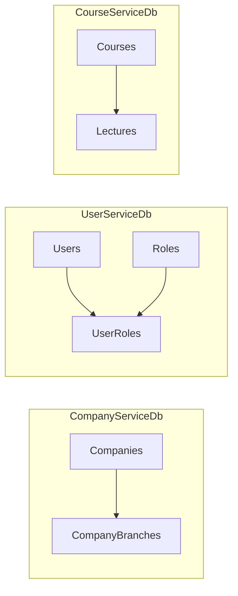
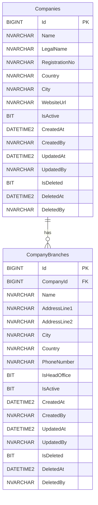
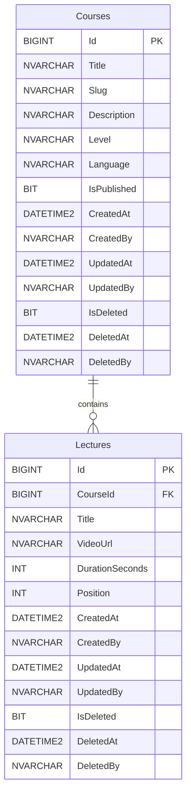

# Database Architecture

This repo uses a database-per-service style. Each service owns its own tables,
and relationships stay inside that service database.

The point is to keep the examples small enough to read, while still showing the
usual pieces: primary keys, foreign keys, soft deletes, audit columns, indexes,
and seed data.



## Company Service

The company service keeps company records and branch records together because a
branch does not make sense without its company.



## User Service

The user service keeps users and roles separate, then connects them through a
bridge table. That keeps the role assignment flexible without duplicating role
data on every user.

```mermaid
erDiagram
    Users ||--o{ UserRoles : assigned
    Roles ||--o{ UserRoles : grants

    Users {
        BIGINT Id PK
        NVARCHAR Email
        NVARCHAR PasswordHash
        NVARCHAR FirstName
        NVARCHAR LastName
        NVARCHAR PhoneNumber
        BIT IsEmailVerified
        BIT IsActive
        DATETIME2 CreatedAt
        NVARCHAR CreatedBy
        DATETIME2 UpdatedAt
        NVARCHAR UpdatedBy
        BIT IsDeleted
        DATETIME2 DeletedAt
        NVARCHAR DeletedBy
    }

    Roles {
        INT Id PK
        NVARCHAR Name
        NVARCHAR Description
        DATETIME2 CreatedAt
        NVARCHAR CreatedBy
        DATETIME2 UpdatedAt
        NVARCHAR UpdatedBy
        BIT IsDeleted
        DATETIME2 DeletedAt
        NVARCHAR DeletedBy
    }

    UserRoles {
        BIGINT UserId PK FK
        INT RoleId PK FK
        DATETIME2 CreatedAt
        NVARCHAR CreatedBy
    }
```

## Course Service

The course service keeps course records and ordered lectures. Lecture order is
handled with the `Position` column, scoped to a single course.



## Shared Schema Conventions

- Main tables use `BIGINT IDENTITY` primary keys.
- Small lookup tables can use `INT IDENTITY`.
- Foreign keys are only defined inside the same service database.
- Soft delete columns are `IsDeleted`, `DeletedAt`, and `DeletedBy`.
- Audit columns are `CreatedAt`, `CreatedBy`, `UpdatedAt`, and `UpdatedBy`.
- Timestamps use `SYSUTCDATETIME()` so the examples are UTC-based.
- Filtered unique indexes keep values unique only when rows are not deleted.
- Seed scripts use simple sample data so the relationships are easy to check.
